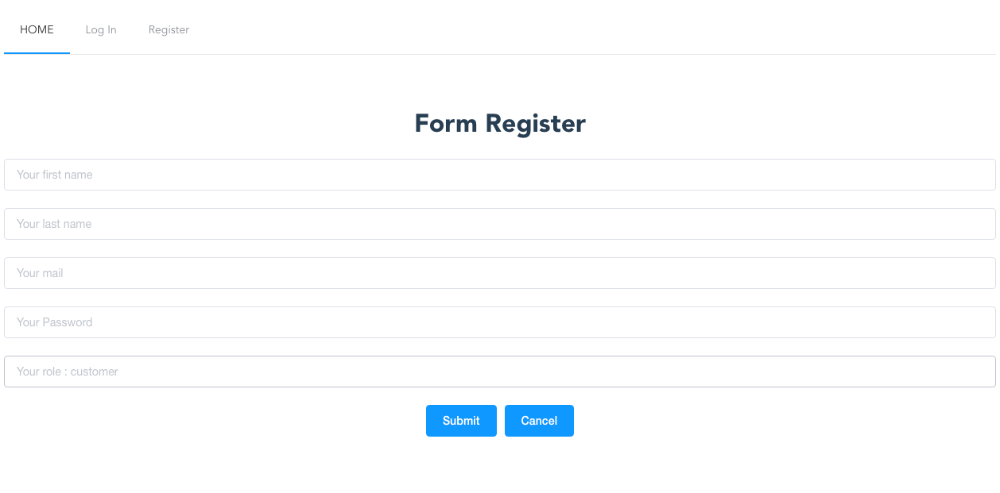
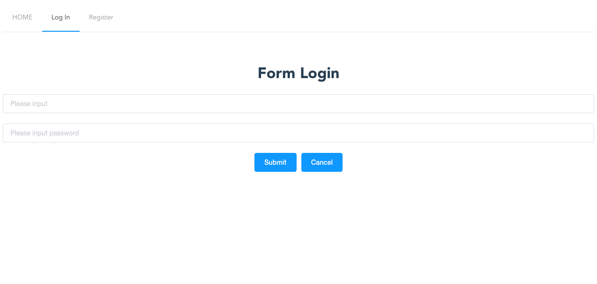
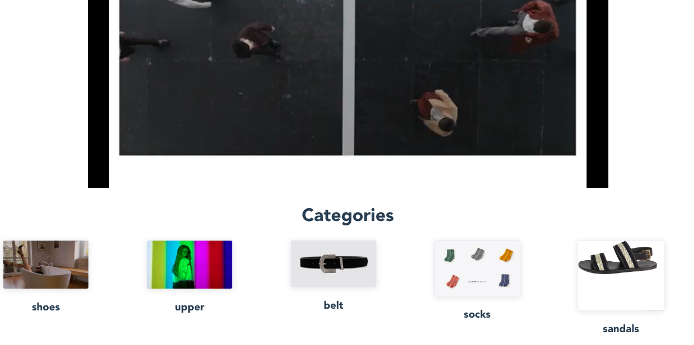
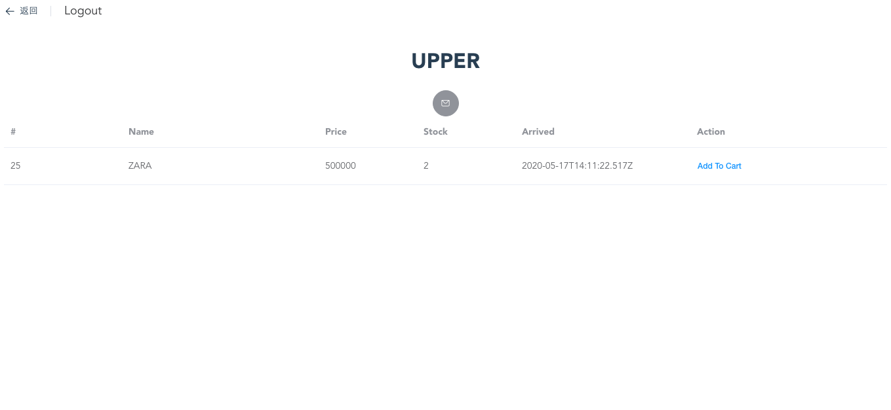
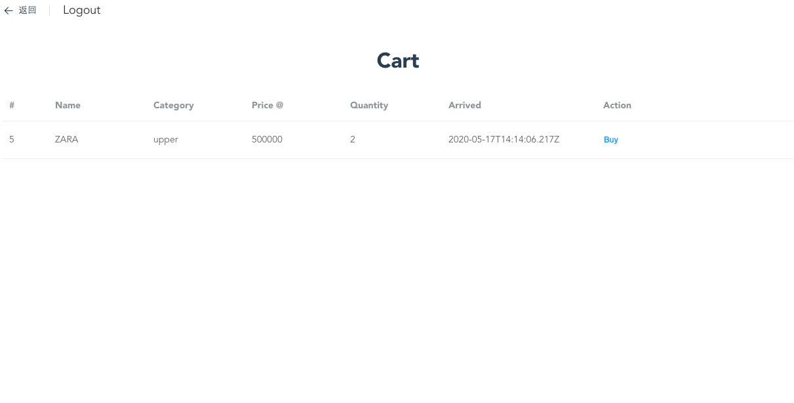

# CMS_Client

How To Use This app?

## Register

if you wanna add product, delete product, add stock product you can fill the `role field` as `admin`, but now we will next as `customer`

please fullfill all fields and submit it, you will be direct to login

if you don't fill for all, you will be stay ar register form

---

## Login

Fill this fields to you will be direct to dashboard

---

## Dashboard

Now you can choose each category, to add the product to you cart

---

## Upper Category

you can add the product you want to your cart

`click mail button below category name`

---
## Cart

this page show you all product that you choose in the store

when you click `buy`, it will be deleted from your cart list

thanks for read this documentation

https://cms-client-52ec6.web.app/